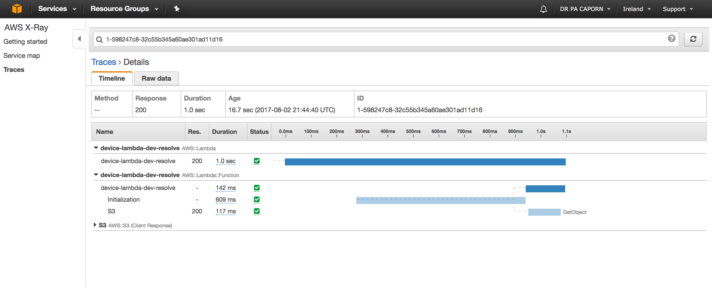

Experiment to learn a bit of serverless, lambda, AWS x-ray.

### Set up

```
npm install -g serverless
npm install
```

To invoke locally:

`serverless invoke local -f resolve --path test.json`

To invoke remotely:

`serverless invoke -f resolve --path test.json`

To run local test loop

`node invoke-lambda.js`

### Environment variables
#### Data file location

If using S3:
* DATA_FILE_S3_BUCKET
* DATA_FILE_S3_PATH 
If using http:
* DATA_FILE_URL

#### Failure testing
Added injectable error and latency values with environment variables
* CHAOS_ERROR_RATE - (0-1) rate of errors induced when loading data file
* CHAOS_LATENCY - injected articical latency in milliseconds for data file read

### X-Ray integration
X-Ray enabled for the lambda and s3 calls captured


